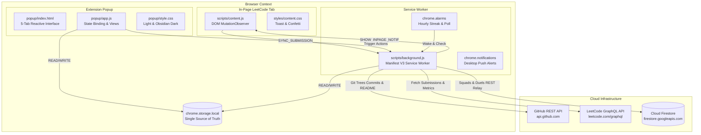
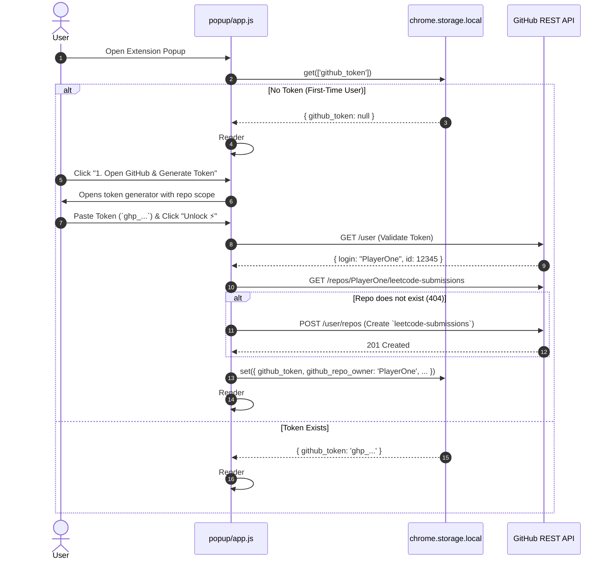
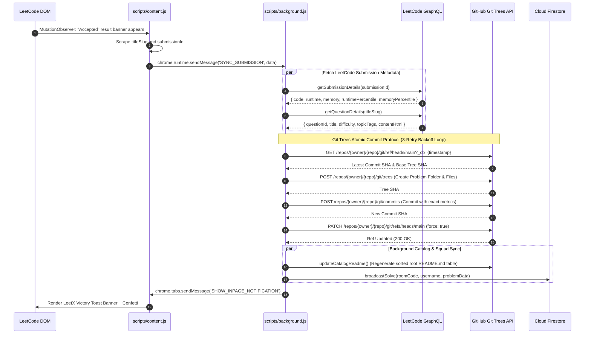
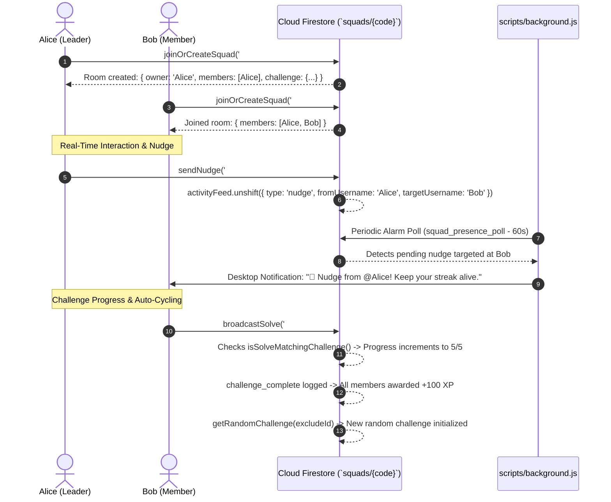
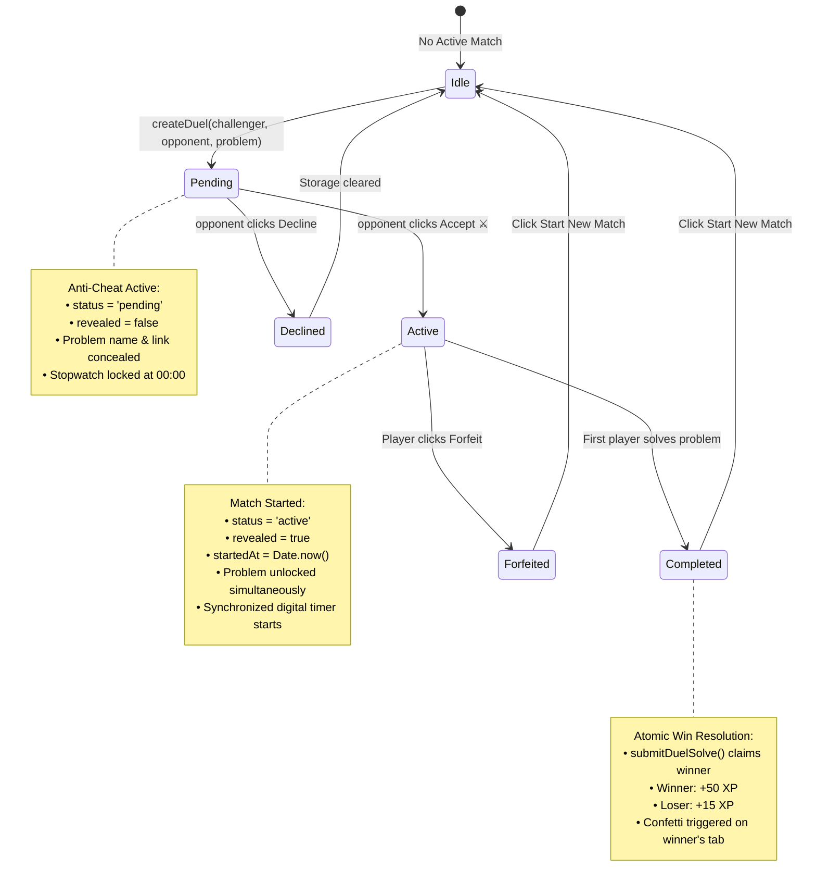
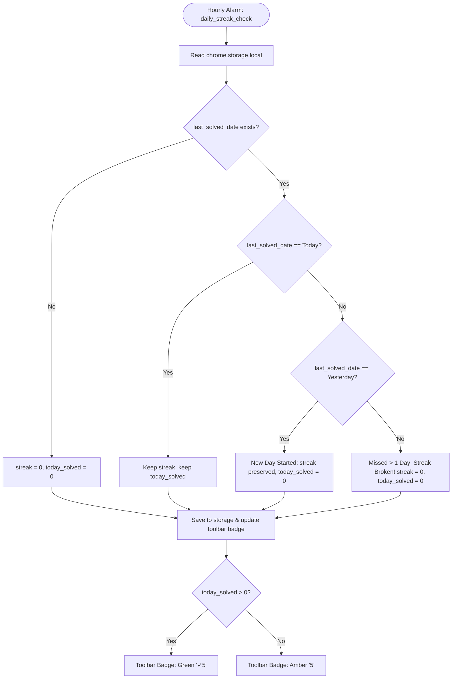

# ⚡ LeetX Squads — Technical Architecture & Codebase Guide

> **Developer & AI Agent Master Handoff Reference** · v1.1.2  
> Production-grade technical architecture documentation covering system topology, message busses, state machines, database schemas, API contracts, and developer workflows.

---

## 📐 Table of Contents

1. [High-Level System Architecture](#1-high-level-system-architecture)
2. [Project Directory & File Responsibility Matrix](#2-project-directory--file-responsibility-matrix)
3. [Extension Layer Isolation Model](#3-extension-layer-isolation-model)
4. [System Flow & Sequence Diagrams](#4-system-flow--sequence-diagrams)
   - [4.1 Authentication & Repository Provisioning](#41-authentication--repository-provisioning)
   - [4.2 Submission Interception & Git Trees Commit Pipeline](#42-submission-interception--git-trees-commit-pipeline)
   - [4.3 Real-Time Multiplayer Squad Lifecycle](#43-real-time-multiplayer-squad-lifecycle)
   - [4.4 1v1 Duel State Machine & Anti-Cheat Protocol](#44-1v1-duel-state-machine--anti-cheat-protocol)
   - [4.5 Streak Calculation & Hourly Alarm Loop](#45-streak-calculation--hourly-alarm-loop)
5. [Database Architecture & Schemas](#5-database-architecture--schemas)
   - [5.1 Google Cloud Firestore REST Model](#51-google-cloud-firestore-rest-model)
   - [5.2 `squads/{roomCode}` Document Specification](#52-squadsroomcode-document-specification)
   - [5.3 `duels/{duelId}` Document Specification](#53-duelsduelid-document-specification)
   - [5.4 Firestore Security Rules (`firestore.rules`)](#54-firestore-security-rules-firestorerules)
   - [5.5 Local Storage Schema (`chrome.storage.local`)](#55-local-storage-schema-chromestoragelocal)
6. [API & Interface Reference](#6-api--interface-reference)
   - [6.1 `GitHubAPI` (`scripts/github.js`)](#61-githubapi-scriptsgithubjs)
   - [6.2 `LeetCodeAPI` (`scripts/leetcode.js`)](#62-leetcodeapi-scriptsleetcodejs)
   - [6.3 `FirebaseSquads` (`scripts/firebase.js`)](#63-firebasesquads-scriptsfirebasejs)
7. [Squad Challenge Pool & Matching Logic](#7-squad-challenge-pool--matching-logic)
8. [Resiliency, Performance & Error Handling](#8-resiliency-performance--error-handling)
9. [Testing, Quality Control & Verification Playbook](#9-testing-quality-control--verification-playbook)
10. [Release Engineering & Build Pipeline](#10-release-engineering--build-pipeline)

---

## 1. High-Level System Architecture



---

## 2. Project Directory & File Responsibility Matrix

```
X:\Projects\leetsync-squads/
├── manifest.json                  # Manifest V3 configuration (permissions, alarms, identity, service worker)
├── README.md                      # Public project documentation & laptop installation guide
├── PROJECT_ARCHITECTURE.md        # Comprehensive technical architecture & handoff guide (This file)
├── firebase.json                  # Firebase deployment configuration for Firestore rules
├── firestore.rules                # Firestore security rules (read/write access for squad rooms & duels)
├── .firebaserc                    # Firebase project identifier mapping (leetsync-squads-app)
├── .gitignore                     # Git ignore rules for clean release distributions
│
├── popup/                         # ─── POPUP LAYER (User Interface) ───
│   ├── index.html                 # Complete popup DOM (611 lines): Onboarding Gateway, 5 Tab Views, Drawer, Toasts
│   ├── style.css                  # Comprehensive design system (2687 lines): Light Mode + Obsidian Dark Mode
│   └── app.js                     # Main popup controller (1800+ lines): UI rendering, data binding, listeners
│
├── scripts/                       # ─── CORE LOGIC ENGINES ───
│   ├── background.js              # Service Worker (740 lines): alarms, async GitHub sync engine, notifications
│   ├── content.js                 # Content script (676 lines): DOM observer, in-page session syncer, confetti
│   ├── github.js                  # GitHub API client (515 lines): ensureRepository, Git Trees commit, README catalog
│   ├── leetcode.js                # LeetCode GraphQL client (450+ lines): getUserStats, daily challenge, submissions
│   ├── firebase.js                # Firestore client (921 lines): squad lifecycle, 25-challenge cycler, 1v1 duels
│   └── package.py                 # Automated build script (89 lines): manifest semver bumper, ZIP compiler
│
├── styles/                        # ─── IN-PAGE STYLES ───
│   └── content.css                # In-page celebration toast, alert banners, and animation keyframes
│
├── assets/                        # ─── STATIC DATA & BRAND ASSETS ───
│   ├── data/
│   │   ├── blind75.json           # Canonical Blind 75 dataset (75 problems with complete schema)
│   │   └── neetcode150.json       # Canonical NeetCode 150 dataset (150 problems across 18 DSA categories)
│   └── icons/
│       ├── icon16.png             # 16x16 toolbar icon
│       ├── icon48.png             # 48x48 extensions management icon
│       └── icon128.png            # 128x128 store avatar & desktop notification icon
│
├── dist/                          # ─── PRODUCTION PACKAGES ───
│   ├── leetx-v1.1.2.zip           # Chrome, Brave, Edge, Arc MV3 production release archive
│   └── leetx-firefox-v1.1.2.zip   # Firefox AMO MV3 release package (with background.scripts fallback)
│
├── scratch/                       # ─── DEVELOPER UTILITIES ───
│   ├── feature_verification.js    # 39-assertion live subsystem test suite
│   └── clean_firestore.js         # Full Firestore database purge utility
│
└── tests/                         # ─── AUTOMATED TEST SUITES ───
    ├── e2e_full_suite.js          # 31-test comprehensive End-to-End automated test suite
    └── test_extension.py          # Python unittest suite verifying manifest and datasets
```

---

## 3. Extension Layer Isolation Model

Chrome Manifest V3 enforces strict sandboxing between three runtime contexts. Communication occurs exclusively via structured asynchronous message passing.

```
┌─────────────────────────────────────────────────────────────────────────────┐
│ 1. POPUP CONTEXT (popup/app.js)                                              │
│    • Lifecycle: Ephemeral (Mounts on icon click, unmounts on blur).         │
│    • Security: Disallowed direct network operations that take >5s.          │
│    • Role: Reactive UI layer. Reads chrome.storage.local for 0ms rendering. │
└──────────────────────┬───────────────────────────────▲──────────────────────┘
                       │ chrome.runtime.sendMessage    │ chrome.storage.onChanged
                       ▼                               │
┌──────────────────────────────────────────────────────┴──────────────────────┐
│ 2. SERVICE WORKER CONTEXT (scripts/background.js)                           │
│    • Lifecycle: Persistent background worker awakened by alarms/events.     │
│    • Capabilities: Full web access, alarms, identity, native notifications. │
│    • Role: Heavy computation, Git Trees commits, Firestore sync, alarms.    │
└──────────────────────▲───────────────────────────────┬──────────────────────┘
                       │ chrome.runtime.sendMessage    │ chrome.tabs.sendMessage
                       │ (SYNC_SUBMISSION)             │ (SHOW_INPAGE_NOTIF)
┌──────────────────────┴───────────────────────────────▼──────────────────────┐
│ 3. CONTENT SCRIPT CONTEXT (scripts/content.js)                              │
│    • Lifecycle: Injected into https://leetcode.com/* on DOM ready.          │
│    • Sandbox: Isolated JS realm sharing DOM with page.                      │
│    • Role: DOM MutationObserver, submissions listener, victory confetti.   │
└─────────────────────────────────────────────────────────────────────────────┘
```

---

## 4. System Flow & Sequence Diagrams

### 4.1 Authentication & Repository Provisioning



---

### 4.2 Submission Interception & Git Trees Commit Pipeline



---

### 4.3 Real-Time Multiplayer Squad Lifecycle



---

### 4.4 1v1 Duel State Machine & Anti-Cheat Protocol



---

### 4.5 Streak Calculation & Hourly Alarm Loop



---

## 5. Database Architecture & Schemas

### 5.1 Google Cloud Firestore REST Model

To operate in a serverless environment without heavy Node.js SDK bundles, LeetX Squads uses the **Firestore v1 REST API** directly:

$$\text{Endpoint: } \texttt{https://firestore.googleapis.com/v1/projects/\{projectId\}/databases/(default)/documents/\{collection\}/\{docId\}}$$

#### Document Serialization (`toFirestoreDoc` / `toFirestoreValue`)
Transforms native JavaScript objects into Firestore's typed value schema:
- **String**: `{ "stringValue": "..." }`
- **Integer**: `{ "integerValue": "123" }`
- **Double**: `{ "doubleValue": 45.6 }`
- **Boolean**: `{ "booleanValue": true }`
- **Array**: `{ "arrayValue": { "values": [...] } }`
- **Map / Object**: `{ "mapValue": { "fields": { ... } } }`
- **Null**: `{ "nullValue": null }`

---

### 5.2 `squads/{roomCode}` Document Specification

The primary entity managing multiplayer rooms, presence, leaderboard scores, and team challenges.

```json
{
  "code": "K9X2P4",
  "owner": "PlayerOne",
  "createdAt": 1724430000000,
  "lastActive": 1724430500000,
  "members": [
    {
      "username": "PlayerOne",
      "streak": 14,
      "todaySolved": 2,
      "totalSolved": 240,
      "xp": 1850,
      "lastSeen": 1724430500000
    },
    {
      "username": "PlayerTwo",
      "streak": 5,
      "todaySolved": 1,
      "totalSolved": 98,
      "xp": 620,
      "lastSeen": 1724429800000
    }
  ],
  "challenge": {
    "id": "ch_trees_5",
    "name": "Tree Traversal Marathon",
    "description": "Solve 5 Tree problems as a squad",
    "category": "Trees",
    "difficulty": "All",
    "target": 5,
    "progress": 3,
    "xpReward": 150
  },
  "activityFeed": [
    {
      "id": "act_1724430500000_a1b2",
      "type": "solve",
      "username": "PlayerOne",
      "text": "@PlayerOne solved #102 Binary Tree Level Order Traversal 🎉",
      "timestamp": 1724430500000
    },
    {
      "id": "act_1724430200000_c3d4",
      "type": "nudge",
      "fromUsername": "PlayerOne",
      "targetUsername": "PlayerTwo",
      "text": "@PlayerOne sent a nudge to @PlayerTwo! 👋",
      "timestamp": 1724430200000
    },
    {
      "id": "act_1724429000000_e5f6",
      "type": "challenge_complete",
      "text": "🏆 Squad Challenge Completed! +150 XP awarded to all members!",
      "timestamp": 1724429000000
    }
  ]
}
```

---

### 5.3 `duels/{duelId}` Document Specification

The match document coordinating live 1v1 speed races between two players.

```json
{
  "id": "duel_1724430000000_x9y2",
  "roomCode": "K9X2P4",
  "challenger": "PlayerOne",
  "opponent": "PlayerTwo",
  "format": "random_blind75",
  "problem": {
    "id": 1,
    "title": "Two Sum",
    "slug": "two-sum",
    "difficulty": "Easy",
    "category": "Arrays & Hashing"
  },
  "status": "active",
  "revealed": true,
  "createdAt": 1724430000000,
  "startedAt": 1724430015000,
  "finishedAt": 1724430345000,
  "winner": "PlayerTwo",
  "loser": "PlayerOne",
  "runtime": {
    "winnerRuntime": "35 ms",
    "winnerMemory": "16.4 MB"
  }
}
```

---

### 5.4 Firestore Security Rules (`firestore.rules`)

Production rules governing public read/write access scoped strictly to valid document field keys:

```javascript
rules_version = '2';
service cloud.firestore {
  match /databases/{database}/documents {
    // Squad rooms — public read/write scoped to valid squad keys
    match /squads/{roomCode} {
      allow read: if true;
      allow write: if request.resource.data.keys().hasAny([
        'members', 'activityFeed', 'challenge', 'lastActive', 
        'code', 'createdAt', 'owner', 'leader'
      ]);
    }

    // 1v1 Duel matches — public read/write scoped to valid duel keys
    match /duels/{duelId} {
      allow read: if true;
      allow write: if request.resource.data.keys().hasAny([
        'id', 'roomCode', 'challenger', 'opponent', 'status', 
        'problem', 'format', 'winner', 'loser', 'startedAt', 
        'finishedAt', 'createdAt', 'revealed', 'runtime'
      ]);
    }

    // Deny all other collections
    match /{document=**} {
      allow read, write: if false;
    }
  }
}
```

---

### 5.5 Local Storage Schema (`chrome.storage.local`)

| Storage Key | Type | Default Value | Description |
|:---|:---:|:---:|:---|
| `github_token` | `string` | `null` | GitHub Personal Access Token (with `repo` scope). |
| `github_repo_owner` | `string` | `null` | Authenticated GitHub username and default display handle. |
| `github_repo_name` | `string` | `'leetcode-submissions'` | Connected backup repository name. |
| `display_name` | `string` | `null` | Squad profile display name override. |
| `leetcode_username` | `string` | `null` | Scraped LeetCode handle for live profile metrics. |
| `streak_count` | `number` | `0` | Consecutive active streak days. |
| `user_xp` | `number` | `0` | Total user gamification XP points. |
| `today_solved` | `number` | `0` | Number of problems solved today (resets at midnight). |
| `last_solved_date` | `string` | `null` | `YYYY-MM-DD` string of the last accepted submission. |
| `user_solved_slugs` | `string[]` | `[]` | Set of unique problem slugs solved by the user. |
| `solved_easy_count` | `number` | `0` | Total Easy problems solved. |
| `solved_med_count` | `number` | `0` | Total Medium problems solved. |
| `solved_hard_count` | `number` | `0` | Total Hard problems solved. |
| `total_solved` | `number` | `0` | Total problems solved across the account. |
| `my_squad_code` | `string` | `''` | Active Squad Room code (empty string if no squad). |
| `active_duel` | `object` | `null` | Cached active / pending duel document for 0ms rendering. |
| `incoming_duel` | `object` | `null` | Cached incoming duel invitation document. |
| `sync_status` | `object` | `{ state: 'idle' }` | Background GitHub sync progress streaming state. |
| `target_open_tab` | `string` | `null` | Route target set by desktop notification click (`'duels'`). |
| `theme_preference` | `string` | `'light'` | `'light'` or `'dark'` (Obsidian Slate). |
| `notifications_enabled` | `boolean` | `true` | Master toggle for OS desktop notifications. |
| `notify_squad_solves_enabled`| `boolean`| `true` | Notification toggle for squad mate solves. |
| `share_solves_enabled` | `boolean` | `true` | Toggle to broadcast own solves to squad room. |
| `review_schedule` | `object` | `{}` | Spaced repetition dictionary `{ [slug]: { dueDate, ... } }`. |
| `duel_wins` | `number` | `0` | Career 1v1 duel victories. |
| `duel_matches` | `number` | `0` | Total career 1v1 duel matches played. |

---

## 6. API & Interface Reference

### 6.1 `GitHubAPI` (`scripts/github.js`)

```typescript
export class GitHubAPI {
  constructor(token: string);

  // Core Request Wrapper
  async request(endpoint: string, options?: RequestInit): Promise<any>;

  // User & Identity
  async getUser(): Promise<{ login: string; id: number; avatar_url: string }>;

  // Repository Operations
  async ensureRepository(repoName: string): Promise<{ repo: any; isNew: boolean; owner: string; name: string }>;
  async getFile(owner: string, repo: string, path: string, ref?: string): Promise<{ sha: string; content: string } | null>;
  async getExistingProblemSlugs(owner: string, repo: string, branch?: string): Promise<string[]>;

  // Atomic Git Trees Commit Engine
  async commitProblemSolution(owner: string, repo: string, payload: {
    frontendId: number;
    title: string;
    titleSlug: string;
    difficulty: string;
    content: string;
    code: string;
    language: string;
    runtimeDisplay: string;
    runtimePercentile: number;
    memoryDisplay: string;
    memoryPercentile: number;
    submittedAt?: number;
    branch?: string;
  }): Promise<{ commitSha: string; folderName: string; commitMessage: string }>;

  // README Problem Catalog Generator
  async updateCatalogReadme(owner: string, repo: string, branch?: string): Promise<void>;

  // Static Helpers
  static buildProblemReadme(title: string, titleSlug: string, difficulty: string, content: string): string;
  static formatCommitMessage(runtime: string, rtPct: number, memory: string, memPct: number): string;
}
```

---

### 6.2 `LeetCodeAPI` (`scripts/leetcode.js`)

```typescript
export class LeetCodeAPI {
  // Authenticated GraphQL Core
  static async query(query: string, variables?: object): Promise<any>;

  // User Profile & Stats
  static async getCurrentUser(): Promise<string | null>;
  static async getUserStats(username: string): Promise<{
    totalSolved: number;
    easySolved: number;
    mediumSolved: number;
    hardSolved: number;
    submissionCalendar: Record<string, number>;
  }>;

  // Problem Metadata
  static async getDailyChallenge(): Promise<{
    id: number;
    title: string;
    titleSlug: string;
    difficulty: string;
    url: string;
    topics: string[];
  }>;
  static async getQuestionDetails(titleSlug: string): Promise<{
    questionId: number;
    title: string;
    difficulty: string;
    content: string;
    topicTags: Array<{ name: string; slug: string }>;
  }>;

  // Submissions
  static async fetchAllAcceptedSubmissions(
    onProgress?: (pct: number) => void,
    username?: string
  ): Promise<Array<{ id: string; title: string; titleSlug: string; lang: string; timestamp: number }>>;
  static async getSubmissionDetails(submissionId: string): Promise<{
    code: string;
    runtime: string;
    memory: string;
    runtimePercentile: number;
    memoryPercentile: number;
    lang: string;
    timestamp: number;
    questionTitle: string;
    titleSlug: string;
  }>;
}
```

---

### 6.3 `FirebaseSquads` (`scripts/firebase.js`)

```typescript
export class FirebaseSquads {
  // REST Primitives
  static async getDocument(collection: string, docId: string): Promise<any | null>;
  static async setDocument(collection: string, docId: string, data: object): Promise<void>;
  static async deleteDocument(collection: string, docId: string): Promise<void>;

  // Room Codes & Identity
  static cleanCode(code: string): string;
  static generateRandomCode(length?: number): string;
  static async generateUniqueRoomCode(): Promise<string>;

  // Squad Management
  static async fetchRemoteSquad(code: string): Promise<SquadDoc | null>;
  static async saveRemoteSquad(code: string, data: SquadDoc): Promise<void>;
  static async joinOrCreateSquad(roomCode: string, userProfile: object): Promise<SquadDoc>;
  static async leaveSquad(roomCode: string, username: string): Promise<void>;
  static async kickMember(roomCode: string, targetUsername: string, actorUsername: string): Promise<void>;
  static async sendNudge(roomCode: string, targetUsername: string, fromUsername: string): Promise<boolean>;

  // Challenge Engine
  static getRandomChallenge(excludeId?: string): Challenge;
  static isSolveMatchingChallenge(challenge: Challenge, problemData: object): boolean;
  static async broadcastSolve(roomCode: string, username: string, problemData: object, streak?: number): Promise<SquadDoc>;
  static async rerollSquadChallenge(roomCode: string, username: string): Promise<Challenge>;
  static async clearActivityFeed(roomCode: string): Promise<void>;

  // 1v1 Duel Lifecycle
  static async createDuel(params: {
    roomCode: string;
    challenger: string;
    opponent: string;
    format: string;
    problem: object;
  }): Promise<DuelDoc>;
  static async acceptDuel(duelId: string, username: string): Promise<DuelDoc>;
  static async declineDuel(duelId: string, username: string): Promise<void>;
  static async forfeitDuel(duelId: string, username: string): Promise<void>;
  static async submitDuelSolve(duelId: string, username: string, runtimeData: object): Promise<DuelDoc>;
  static async checkDuelStatus(username: string, roomCode: string): Promise<{
    activeDuel: DuelDoc | null;
    incomingChallenges: DuelDoc[];
  }>;
}
```

---

## 7. Squad Challenge Pool & Matching Logic

The system maintains 25 curated challenges. The `isSolveMatchingChallenge()` function executes deterministic category, difficulty, and problem set matching:

| Challenge ID | Name | Target Category / Condition | Target Count | XP Reward |
|:---|:---|:---|:---:|:---:|
| `ch_easy_3` | Quick Warmup | Difficulty: `Easy` | 3 | +100 XP |
| `ch_easy_5` | Easy Sprint | Difficulty: `Easy` | 5 | +150 XP |
| `ch_med_3` | Medium Tier | Difficulty: `Medium` | 3 | +150 XP |
| `ch_med_5` | Medium Gauntlet | Difficulty: `Medium` | 5 | +200 XP |
| `ch_hard_2` | Hard Boss Fight | Difficulty: `Hard` | 2 | +200 XP |
| `ch_hard_3` | Hard Marathon | Difficulty: `Hard` | 3 | +250 XP |
| `ch_arrays_5` | Array & Hashing | Category: `Arrays & Hashing` | 5 | +150 XP |
| `ch_pointers_4` | Two Pointer Rush | Category: `Two Pointers` | 4 | +150 XP |
| `ch_sliding_4` | Sliding Window | Category: `Sliding Window` | 4 | +150 XP |
| `ch_stack_4` | Stack Mastery | Category: `Stack` | 4 | +150 XP |
| `ch_binsearch_4` | Binary Search Drill | Category: `Binary Search` | 4 | +150 XP |
| `ch_trees_5` | Tree Traversal | Category: `Trees` | 5 | +150 XP |
| `ch_graphs_4` | Graph Exploration | Category: `Graphs` | 4 | +200 XP |
| `ch_backtrack_3` | Backtracking | Category: `Backtracking` | 3 | +200 XP |
| `ch_heaps_3` | Heap / Priority Queue | Category: `Heap / Priority Queue` | 3 | +200 XP |
| `ch_dp_3` | 1-D Dynamic Programming | Category: `1-D Dynamic Programming` | 3 | +200 XP |
| `ch_dp2_3` | 2-D Dynamic Programming | Category: `2-D Dynamic Programming` | 3 | +250 XP |
| `ch_greedy_4` | Greedy Strategy | Category: `Greedy` | 4 | +150 XP |
| `ch_blind75_5` | Blind 75 Push | Problem in `blind75.json` | 5 | +200 XP |
| `ch_neetcode150_5`| NeetCode 150 Push | Problem in `neetcode150.json` | 5 | +200 XP |
| `ch_speed_5` | Speed Sprint | Difficulty: `Easy` | 5 | +100 XP |
| `ch_boss_2` | Boss Fight | Difficulty: `Hard` | 2 | +250 XP |
| `ch_daily_3` | Daily Streak Push | Today's Daily Problem | 3 | +150 XP |
| `ch_linkedlist_4`| Linked List Focus | Category: `Linked List` | 4 | +150 XP |
| `ch_tries_3` | Advanced Tries & Bits | Category: `Tries` / `Bit Manipulation` | 3 | +200 XP |

---

## 8. Resiliency, Performance & Error Handling

1. **Git Trees Atomic Multi-File Commits**:
   - Committing problem code and `README.md` in a single Git Tree avoids sequential PUT race conditions.
   - **3-Attempt Exponential Backoff**: Retries on transient `409 Conflict` or `422 Update is not a fast forward` errors.
   - **SHA Cache-Busting**: Appends `?_cb=${Date.now()}` to all Git reference queries to bypass intermediate GitHub CDN caches.

2. **0ms Instant Cache UI Mounting**:
   - Popup views read directly from `chrome.storage.local` cache on load, completely eliminating UI flicker or network-wait spinners.

3. **Background Sync Resilience**:
   - Long-running solution backfills execute detached inside the Background Service Worker. The user can close the popup or switch tabs without breaking sync.

4. **Multiplayer Ambiguity Prevention**:
   - 6-character room codes filter out visually confusing characters (`0`, `O`, `1`, `I`) to ensure flawless voice or text communication among teammates.

---

## 9. Testing, Quality Control & Verification Playbook

### Automated End-to-End Test Suite (31 Tests)
Validates Manifest compliance, roadmap integrity, GitHub formatting, Firestore squads, 1v1 state machines, and DOM structure:
```powershell
node tests/e2e_full_suite.js
```

### Live Subsystem Verification Suite (39 Tests)
```powershell
node scratch/feature_verification.js
```

### Structural Python Unit Tests (6 Tests)
```powershell
python -m unittest tests/test_extension.py
```

### JavaScript Syntax & Static Analysis
```powershell
node --check popup/app.js
node --check scripts/background.js
node --check scripts/firebase.js
node --check scripts/github.js
node --check scripts/leetcode.js
node --check scripts/content.js
```

### Clean-Slate Database Reset
```powershell
node scratch/clean_firestore.js
```

---

## 10. Release Engineering & Build Pipeline

Automated packaging compiles and versions zip archives for Chrome Web Store and Firefox AMO distributions:

```powershell
# Bump patch (1.1.2 -> 1.1.3)
python scripts/package.py patch

# Bump minor (1.1.2 -> 1.2.0)
python scripts/package.py minor
```

### Output Packages:
- **`dist/leetx-v1.1.2.zip`**: Chrome, Brave, Edge, Arc (MV3 Service Worker).
- **`dist/leetx-firefox-v1.1.2.zip`**: Firefox AMO (with `background.scripts` fallback).
- **`~/Downloads/leetx-v1.1.2.zip`**: Auto-copied directly to Downloads for fast local testing.

---

<div align="center">
  <sub>⚡ LeetX Squads Technical Architecture Document • Maintained by <a href="https://github.com/NINJA981">NINJA981</a> • Repository: <a href="https://github.com/NINJA981/LeetX">NINJA981/LeetX</a></sub>
</div>
